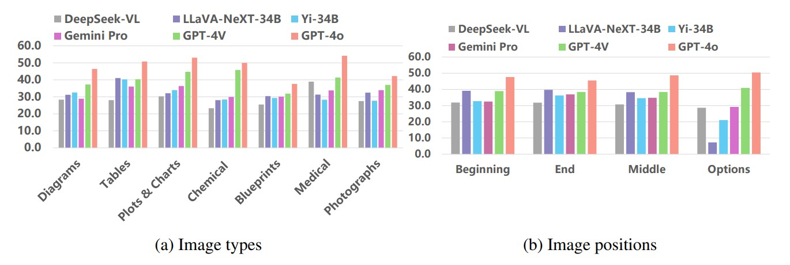

# M4U: Evaluating Multilingual Understanding and Reasoning for Large Multimodal Models

 
 
 
 


Code for the Paper M4U: Evaluating Multilingual Understanding and Reasoning for Large Multimodal Models.

[[Webpage](https://m4u-benchmark.github.io/m4u.github.io/)] [[Paper](http://arxiv.org/abs/2405.15638)] [[Huggingface Dataset](https://huggingface.co/datasets/M4U-Benchmark/M4U)] [[Leaderboard](https://m4u-benchmark.github.io/m4u.github.io/)]

<p align="center">
     <br>
  <b>M4U</b>: Evaluating Multilingual Understanding and Reasoning for Large Multimodal Models
</p>

## Outlines

- [💥 News 💥](https://github.com/M4U-Benchmark/M4U/tree/main?tab=readme-ov-file#-news-)
- [👀 About M4U](https://github.com/M4U-Benchmark/M4U/tree/main?tab=readme-ov-file#-about-m4u)
- [🏆 Leaderboard 🏆](https://github.com/M4U-Benchmark/M4U/tree/main?tab=readme-ov-file#-leaderboard-)
  - [Contributing the Leaderboard](https://github.com/M4U-Benchmark/M4U/tree/main?tab=readme-ov-file#contributing-the-leaderboard)
  - [Leaderboard](https://github.com/M4U-Benchmark/M4U/tree/main?tab=readme-ov-file#leaderboard)
- [📖 Dataset Usage](https://github.com/M4U-Benchmark/M4U/tree/main?tab=readme-ov-file#-dataset-usage)
  - [Examples](https://github.com/M4U-Benchmark/M4U/tree/main?tab=readme-ov-file#examples)
  - [Format](https://github.com/M4U-Benchmark/M4U/tree/main?tab=readme-ov-file#format)
  - [Download](https://github.com/M4U-Benchmark/M4U/tree/main?tab=readme-ov-file#download)
- [🔮 Evaluations on M4U](https://github.com/M4U-Benchmark/M4U/tree/main?tab=readme-ov-file#-evaluations-on-m4u)
  - [Evaluating LLaVA](https://github.com/M4U-Benchmark/M4U/tree/main?tab=readme-ov-file#evaluating-llava)
  - [Evaluating OpenAI Models](https://github.com/M4U-Benchmark/M4U/tree/main?tab=readme-ov-file#evaluating-openai-models)
- [📊 Statistics]()
  - [GPT-4o's Performance on Different Discipline]()
  - [Resolution of Images in M4U]()   
- [✅ Cite](https://github.com/M4U-Benchmark/M4U/tree/main?tab=readme-ov-file#-cite)
- [🧠 Acknowledgments](https://github.com/M4U-Benchmark/M4U/tree/main?tab=readme-ov-file#-acknowledgments)


## 💥 News 💥

- **[2024.08.16]** [M4U-mini](https://huggingface.co/datasets/M4U-Benchmark/M4U-mini) is public aviailable, which is our first step to extend M4U for more languages. M4U-mini is a tiny subset (5%) of M4U with the support for Japanese, Arabic and Thai.
- **[2024.05.23]** Our [paper](http://arxiv.org/abs/2405.15638) and [dataset](https://huggingface.co/datasets/M4U-Benchmark/M4U) are public aviailable.

## 👀 About M4U

<p align="center">
     <br>
</p>

Multilingual multimodal reasoning is a core component to achieve human-level intelligence. However, most of the existing benchmarks for multilingual multimodal reasoning struggle to differentiate between models of varying performance: even language models that don't have visual capabilities can easily achieve high scores. This leaves a comprehensive evaluation for the leading multilingual multimodal models largely unexplored. 

<p align="center">
     <br>
    The detailed statistics of <b>M4U</b> dataset.
</p>

In this work, we introduce M4U, a novel and challenging benchmark for assessing the capability of multi-discipline multilingual multimodal understanding and reasoning. M4U contains 8,931 samples covering 64 disciplines of 16 subfields from Science, Engineering and Healthcare in Chinese, English and German.

<p align="center">
     <br>
</p>

With M4U, we conduct extensive evaluations for 21 leading LMMs and LLMs with external tools. The evaluation results show that the state-of-the-art model, GPT-4o, only achieves 47.6\% average accuracy on M4U. Besides, we observe that the leading LMMs have significant language preferences.

<p align="center">
     <br>
</p>

Our in-depth analysis shows that the leading LMMs, including GPT-4o, suffer from the performance degradation when they are prompted with cross-lingual multimodal questions, e.g., the images have key textual information in Chinese, while the question is in English or German. 

<p align="center">
     <br>
</p>

We further analyze the impact of different types of visual content and image positions. The experimental results show that GPT-4o significantly outperforms the other models in medical images, and LLaVA-NeXT has difficulty answering questions where images are included in the options.

## 🏆 Leaderboard 🏆

### Contributing the Leaderboard

🚨🚨 The leaderboard is continuously being updated. 

If you want to upload your model's results to the Leaderboard, please send an email to [Hongyu Wang](mailto:hongyu.wang@vipl.ict.ac.cn) and [Ruiping Wang](mailto:wangruiping@ict.ac.cn).

The evaluation instructions are available at [🔮 Evaluations on M4U](https://github.com/M4U-Benchmark/M4U/tree/main?tab=readme-ov-file#-evaluations-on-m4u).

### Leaderboard

| **#** | **Model**                       | **Method** | **Source**                                                   | **English** | **Chinese** | **German** | **Average** |
| ----- | ------------------------------- | ---------- | ------------------------------------------------------------ | ----------- | ----------- | ---------  | ----------- |
| 1     | GPT-4o                          | LMM      | gpt-4o                                                       | 47.8        | 49.4        | 45.6       | 47.6        |
| 2     | GPT-4V + CoT                    | LMM      | gpt-4-vision-preview                                         | 43.6        | 43.9        | 40.3       | 42.6        |
| 3     | GPT-4V                          | LMM      | gpt-4-vision-preview                                         | 39.4        | 39.7        | 37.3       | 38.8        |
| 4     | LLaVA-NeXT 34B                  | LMM      | [LINK](https://huggingface.co/liuhaotian/llava-v1.6-34b)     | 36.2        | 38.5        | 35.2       | 36.6        |
| 5     | Gemini 1.0 Pro + CoT            | LMM      | gemini-pro-vision                                            | 34.2        | 34.4        | 33.9       | 34.2        |
| 6     | Gemini 1.0 Pro                  | LMM      | gemini-pro                                                   | 32.7        | 34.9        | 30.8       | 32.8        |
| 6     | Qwen-1.5 14B Chat(+Caption)     | Tool     | [LINK](https://huggingface.co/Qwen/Qwen1.5-14B-Chat)         | 32.0        | 32.7        | 33.8       | 32.8        |
| 8     | Yi-VL 34B                       | LMM      | [LINK](https://huggingface.co/01-ai/Yi-VL-34B)               | 33.3        | 33.5        | 30.5       | 32.4        |
| 9     | Yi-VL 6B                        | LMM      | [LINK](https://huggingface.co/01-ai/Yi-VL-6B)                | 31.4        | 33.4        | 29.7       | 31.5        |
| 10     | DeepSeek VL Chat                | LMM      |[LINK](https://huggingface.co/deepseek-ai/deepseek-vl-7b-chat)| 32.8        | 30.4        | 30.8       | 31.3        |
| 11     | Qwen-1.5 7B Chat(+Caption)      | Tool     | [LINK](https://huggingface.co/Qwen/Qwen1.5-7B-Chat)          | 27.7        | 34.2        | 31.7       | 31.2        |
| 11     | Gemini 1.0 Pro(+Caption)        | Tool     | gemini-pro                                                   | 31.1        | 31.6        | 33.8       | 31.2        |
| 13     | InternLM-XComposer VL           | LMM      | [LINK](internlm/internlm-xcomposer-vl-7b)                    | 31.6        | 31.8        | 30.9       | 30.8        |
| 14     | LLaVA-NeXT Mistral-7B           | LMM      |[LINK](https://huggingface.co/liuhaotian/llava-v1.6-mistral-7b)| 30.6       | 28.2        | 29.4       | 29.4        |
| 15     | CogVLM Chat                     | LMM      | [LINK](https://huggingface.co/THUDM/cogvlm-chat-hf)          | 30.2        | 28.9        | 28.5       | 29.2        |
| 16     | Qwen-VL Chat                    | LMM      | [LINK](https://huggingface.co/Qwen/Qwen-VL-Chat)             | 29.9        | 29.7        | 27.1       | 28.9        |
| 17     | LLaVA-NeXT Vicuna-13B           | LMM      |[LINK](https://huggingface.co/liuhaotian/llava-v1.6-vicuna-13b)| 30.9       | 21.9        | 29.3       | 27.4        |
| 18     | Mistral-Instruct-7B v0.2(+Caption)| Tool     |[LINK](https://huggingface.co/mistralai/Mistral-7B-Instruct-v0.2)| 24.9     | 24.9        | 26.9       | 25.6        |
| 19     | LLaVA-NeXT Vicuna-7B            | LMM      |[LINK](https://huggingface.co/liuhaotian/llava-v1.6-vicuna-7b)| 29.8        | 11.8        | 28.2       | 23.3        |
| 20     | InstructBLIP Vicuna-7B          | LMM      |[LINK](https://huggingface.co/Salesforce/instructblip-vicuna-7b)| 28.1      | 13.7        | 19.7       | 20.5        |
| 21     | InstructBLIP Vicuna-13B         | LMM      |[LINK](https://huggingface.co/Salesforce/instructblip-vicuna-13b)| 23.4     | 10.5        | 18.6       | 17.5        |
| 22     | YingVLM                         | LMM      | [LINK](https://huggingface.co/MMInstruction/YingVLM)         | 11.2        | 22.3        | 15.6       | 16.4        |
| 23     | VisualGLM                       | LMM      | [LINK](https://huggingface.co/THUDM/visualglm-6b)            | 22.4        | 8.7         | 13.5       | 14.9        |


- **Method types**
  -  **LMM :** Large Multimodal Model
  -  **Tool :** Tool-augmented Large Language Model. The captions are generated by Gemini 1.0 Pro.

## 📖 Dataset Usage

### Examples
An example from the Chemistry-Inorganic of M4U dataset:

<p align="center">
     <br>
</p>

### Format

The dataset is in json format. We provide the detailed attributes as follows:

```
{
    "question": [string] The question text,
    "image_files": [list] The images stored in bytes
    "image_caption": [list] The image caption generated by Gemini Pro 1.0
    "image_type": [list] The category of the images
    "options": [list] Choices for multiple-choice problems.
    "answer": [string] The correct answer for the problem,
    "answer_index": [integer] The correct answer index of the options for the problem,
    "language": [string] Question language: "en", "zh", or "de",
    "discipline": [string] The discipline of the problem: "Geophysics" or "Optical",
    "subfield": [string] The subfield of the problem: "Math" or "Geography"
    "field": [string] The field of the problem: "science", "engineering" or "healthcare"
    "cross_lingual": [bool] Whether the visual content of the problem has the key information or concepts
}
```

### Download

First, make sure that you have successfully setup:

```sh
pip install datasets
```

Then you can easily download this dataset from Huggingface.
```python
from datasets import load_dataset

dataset = load_dataset("M4U-Benchmark/M4U")
```

Here are some examples of how to access the downloaded dataset:

```python
# print the first example on the science_en split
print(dataset["science_en"][0])
print(dataset["science_en"][0]['question']) # print the question 
print(dataset["science_en"][0]['options']) # print the options
print(dataset["science_en"][0]['answer']) # print the answer
```

## 🔮 Evaluations on M4U

We provide the evaluation pipelines for the open-source LLaVA and closed-source model GPT-4o, respectively. The pipeline is very simple and easy to use.

### Evaluating LLaVA

First you should follow the [instructions](https://github.com/haotian-liu/LLaVA/tree/main?tab=readme-ov-file#install) to clone the LLaVA repository and install the Python dependencies.

```sh
git clone https://github.com/haotian-liu/LLaVA.git
pip install -e LLaVA/
```

Generate the response of LLaVA-NeXT 34B:

```sh
python evaluate_llava.py\
  --model liuhaotian/llava-v1.6-34b \
  --conv_mode chatml_direct \
  --field all \
  --lang all \
  --result_folder ./llava_next_34b
```

Calculate the final scores:

```sh
python calculate_scores.py \
  --field all \
  --lang all \
  --result_folder ./llava_next_34b
```

### Evaluating OpenAI Models

Replace "/your/api/key" in [evaluate_gpt4o.py](https://github.com/M4U-Benchmark/M4U/blob/a805dec1c6cf9347ee0e9b63cfbfbca0fd1080b9/evaluate_gpt4o.py#L17) with your personal key. Then generate the response of GPT-4o:
```sh
python evaluate_gpt4o.py \
  --model gpt-4o \
  --field all \
  --lang all \
  --result_folder ./result/M4U/gpt4o
```

Calculate the final scores:

```sh
python calculate_scores.py \
  --field all \
  --lang all \
  --result_folder ./result/M4U/gpt4o
```

## 📊 Statistics

We depict some critical statistical results on this section, including detailed statistics of GPT-4o's performance on different discipline and language, and visualization of image quality. These detailed statistics will also help understanding and further analysis for M4U.

### GPT-4o's Performance on Different Discipline

To further analyze performance of MLLMs on different disciplines, we provided statistics of GPT-4o's performance on 64 different disciplines in M4U. These three figures shown results of GPT-4o on Chinese, English, and German. Disciplines on these images are shown in corresponding language.

<p align="center">
     <br>
</p>

<p align="center">
     <br>
</p>

<p align="center">
     <br>
</p>

### Resolution of Images in M4U

To verify auality of images provided in M4U, we visualized the distribution of diagonal pixels in the images. The median of diagonal pixels is 551, and the average is 616. The distribution is shown below.

<p align="center">
     <br>
</p>

## ✅ Cite

If you find **M4U** useful for your research and applications, please kindly cite using this BibTeX:

```latex
@article{wang2024m4u,
  title={M4U: Evaluating Multilingual Understanding and Reasoning for Large Multimodal Models},
  author={Hongyu Wang and Jiayu Xu and Senwei Xie and Ruiping Wang and Jialin Li and Zhaojie Xie and Bin Zhang and Chuyan Xiong and Xilin Chen},
  month={May},
  year={2024}
}
```

## 🧠 Acknowledgments

Some implementations in M4U are either adapted from or inspired by the [MMMU](https://github.com/MMMU-Benchmark/MMMU) repository and the [MathVista](https://github.com/lupantech/MathVista) repository.
